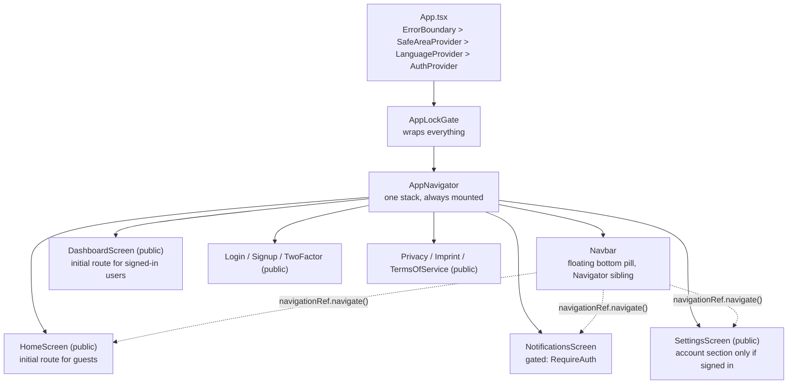
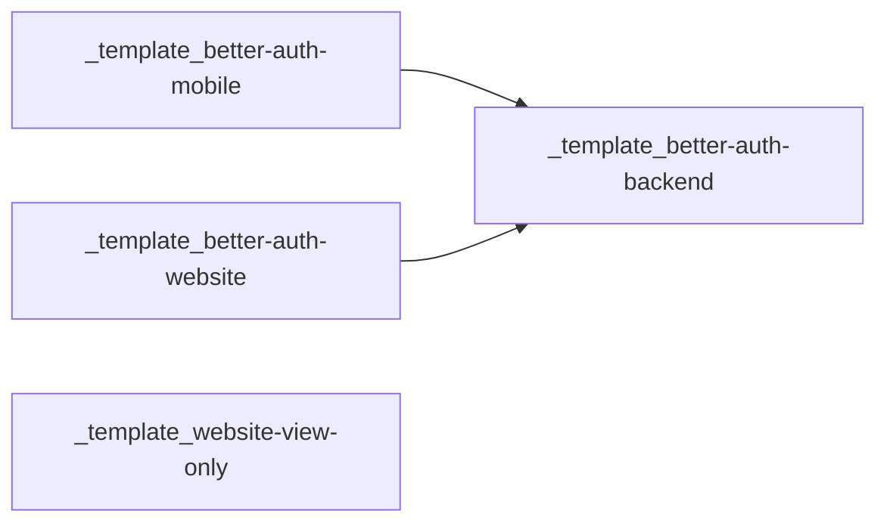

# Better Auth Mobile Template

An Expo/React Native app wired to `_template_better-auth-backend`'s Hono server. Like the website template, this app has no session store, no user table, and no auth logic of its own — every sign-in, sign-up, and session check is a real network call to the backend, using Better Auth's own Expo client.

It ships "browse first": a guest can open the app and look around before ever creating an account, and only hits a login wall when they try to do something that actually needs one. That pattern — not a route-level flag, but two small, reusable primitives — is the main thing this template adds on top of a working auth flow.

## Table of contents

- [Getting started](#getting-started)
- [Architecture](#architecture)
- [Guest mode](#guest-mode)
- [Adding a new API request](#adding-a-new-api-request)
- [Theming](#theming)
- [Color palettes & theming](#color-palettes--theming)
- [Keyboard handling](#keyboard-handling)
- [Adding a new popup](#adding-a-new-popup)
- [State and storage](#state-and-storage)
- [Screens](#screens)
- [Configuration](#configuration)
- [Security](#security)
- [Key decisions](#key-decisions)
- [Operations](#operations)
- [Testing and CI](#testing-and-ci)
- [How this fits into the template suite](#how-this-fits-into-the-template-suite)
- [License](#license)

## Getting started

```
npm install
cp .env.example .env   # point EXPO_PUBLIC_BACKEND_URL at a running _template_better-auth-backend
npm start
```

Then press `a` for Android, `i` for iOS, or `w` for web in the Expo CLI, or scan the QR code with Expo Go. The backend must already be running and reachable from wherever the app runs — on a physical device that means your machine's LAN IP, not `localhost`.

### Scripts

| Script | Purpose |
|---|---|
| `npm start` | Start the Expo dev server |
| `npm run android` / `npm run ios` / `npm run web` | Start and open a specific platform |
| `npm run typecheck` | `tsc --noEmit` |
| `npm run lint` | ESLint |
| `npm test` | Jest |

## Architecture



`AuthProvider` (`src/auth/AuthProvider.tsx`) is the single source of truth for auth state — every screen reads `useAuth()` rather than calling `authClient` directly, so `signIn`/`signUp`/`signOut`/`updateProfile`/`changePassword`/`listSessions`/`revokeSession`/`enableTwoFactor`/`disableTwoFactor`/`resendVerificationEmail`/`requestPasswordReset` all live in one place with one consistent `{ success, error? }` return shape. `AppNavigator` reads `isAuthenticated`/`twoFactorPending` from it to decide what's reachable, but never talks to `authClient` itself.

Layout:

```
src/
├── auth/            # AuthProvider, RequireAuth, Better Auth client, app-lock storage
├── components/       # Logo, Navbar, AppLock, Settings sub-components, modals, KeyboardAwareScreen (react-native-keyboard-controller)
├── contexts/         # i18n (LanguageContext + per-area translation tables)
├── error/            # ErrorBoundary
├── hooks/            # useRequireAuth, useAttemptLockout, useNotifications
├── legal/            # Privacy/Imprint/TermsOfService screens, first-launch ToS modal
├── lib/              # api.ts (apiFetch<T> wrapper, see "Adding a new API request")
├── navigation/       # AppNavigator (the one stack), navigationRef (imperative nav helper)
├── screens/          # Home, Dashboard, Notifications, Login, Signup, TwoFactor, Settings, AppLock
└── theme/            # colors.ts — the one place a JS-prop color is looked up
```

## Guest mode

There is no split between a fully-public and a fully-authenticated navigator. The one auth-based branch is the initial route itself: guests land on `Home`, already-authenticated users skip straight to `Dashboard` (a placeholder landing screen — swap it for your real one) so a relaunch doesn't show a signed-in user the guest marketing screen first. Beyond that initial route — unlike earlier versions of this template — **no screen in the stack is gated by default either**, including `Settings`. `Settings` turned out to hold mostly guest-relevant content (language, theme, App Lock PIN, legal pages) alongside the handful of account-specific sections (profile, password, 2FA, sessions), so the screen itself is public; only those account sections inside it check `useAuth().isAuthenticated` and swap themselves for a sign-in/sign-up prompt when it's false. `AppLockGate` wraps the whole navigator unconditionally and stays inert until a PIN actually exists — guest or signed in, whoever sets one up locks the app the same way.

That said, `RequireAuth`/`useRequireAuth` are still here as the two conventions a real product reaches for once it *does* have something that needs a real session — nothing in the shipped template currently calls either (there's nothing left in this bare template that requires an account), but they're maintained, tested, and meant to be copied.

**Gate a whole screen** — wrap it in `src/auth/RequireAuth.tsx`:

```tsx
<RequireAuth>
  <SomeAccountOnlyScreen ... />
</RequireAuth>
```

Redirects to `Login` (with `returnTo` set to the current route) while `useAuth().isAuthenticated` is false, rendering `fallback` (or nothing) in the meantime. Use this for a screen with no meaningful guest view at all.

**Gate a single action on an otherwise-public screen** — call `src/hooks/useRequireAuth.ts`'s `requireAuth(action)`:

```tsx
const { requireAuth } = useRequireAuth();
<TouchableOpacity onPress={() => requireAuth(() => doTheThing())} />
```

Runs `action` immediately if signed in, otherwise redirects to Login with `returnTo` set to the current route. Use this for a public screen where only some actions actually need an account — this was `HomeScreen.tsx`'s original pattern for its placeholder feature cards, before those cards started pointing at the now-public `Settings` and the wrapper stopped making sense there.

### Adding a protected screen

1. Build the screen component under `src/screens/` as usual.
2. Decide whole-screen vs. single-action gating (see the two conventions above) and wire it accordingly. For a whole screen:
   ```tsx
   <RootStack.Screen name="Billing">
     {() => (
       <RequireAuth>
         <BillingScreen />
       </RequireAuth>
     )}
   </RootStack.Screen>
   ```
3. Add the route name to `RootStackParamList` in `src/navigation/AppNavigator.tsx` and register the `<RootStack.Screen>` inside `MainNavigator` (not `TwoFactorNavigator` — that stack is only ever mounted mid-login).
4. If the screen needs a permanent entry point rather than only being reached from another screen's button, add it to `NAV_ITEMS` in `src/components/Navbar.tsx` — it's a plain array (`{ route, labelKey, Icon }`), so this is one new entry, not a restructure. Note that `Navbar.tsx` itself can't use `useNavigation()`/`useRoute()`/`useRequireAuth()` (it's a `RootStack.Navigator` sibling, not one of its screens — see the comment in `src/navigation/navigationRef.ts`); a Navbar item that needs to gate itself should check `useAuth().isAuthenticated` directly and call the exported `navigate()` helper, the same way the Settings icon does today.
5. Every *other* screen (rendered as an actual `<RootStack.Screen>`, unlike `Navbar`) can use `useNavigation()`/`useRoute()`/`useRequireAuth()` normally — the restriction in step 4 is specific to `Navbar`.

## Adding a new API request

There's no data-fetching library here (no react-query, no SWR). `src/lib/api.ts`'s `apiFetch<T>` (added for the notification routes, see `src/hooks/useNotifications.ts` for a real example of both hook shapes below) is the one shared request helper — `src/screens/SettingsScreen.tsx`'s `DebugSection` still calls the backend's `GET /examples/ping` with a plain `fetch()` since it predates `apiFetch`, but any new route should go through `apiFetch` instead of copy-pasting `fetch()` calls.

**1. Confirm the backend route exists first.** Every path has to match a real route in `_template_better-auth-backend/src/routes/*.ts` — see that repo's README section "Adding a new API route" if it doesn't exist yet. A mismatched path fails at runtime with a 404, not a type error.

**2. The typed fetch wrapper, `apiFetch<T>` in `src/lib/api.ts`, already exists — reuse it.** It's built on `authClient.$fetch` (from `src/auth/auth-client.ts`) so the session cookie is attached automatically — never add an `Authorization` header by hand — and have it throw a small `ApiError` (`status`/`code`/`details`) on any non-2xx response, matching the backend's `AppError` shape. Inside `apiFetch`, always call `$fetch` with an *absolute* URL (`` `${backendUrl}${path}` ``, importing `backendUrl` from `auth-client.ts`), never the bare `path` callers pass in: `authClient` is configured with `baseURL: backendUrl`, but better-auth's client resolves a relative path against `${backendUrl}/api/auth` (its own routes' base, see `withPath()` in better-auth's `client/utils/url.ts`), not `backendUrl` itself. A bare `/profile/me` silently resolves to `/api/auth/profile/me` — a path Better Auth's own handler doesn't recognize, so it 404s with an empty, non-JSON body instead of your actual route's response. Callers themselves keep passing bare paths — `apiFetch` is the one place that prepends `backendUrl`, so nothing above it has to think about this:

```ts
apiFetch<{ data: Profile }>('/profile/me');
apiFetch<{ data: Profile }>('/profile/me', { method: 'PATCH', body: input });
```

**3. Add the call to a hook, not to a screen.** Screens shouldn't call `apiFetch` (or `fetch`) directly once there's more than the one-off debug ping — put each request behind a `useXxx.ts` hook under `src/hooks/`, in whichever of these two shapes fits:

- **Fetches data on mount** — `useState` for the data/loading/error, a `useCallback`'d `refetch`, and a `useEffect` that calls it once:

```ts
export function useWidgets() {
  const { isAuthenticated } = useAuth();
  const [widgets, setWidgets] = useState<Widget[]>([]);
  const [loading, setLoading] = useState(isAuthenticated);
  const [error, setError] = useState<string | null>(null);

  const refetch = useCallback(async () => {
    if (!isAuthenticated) { setWidgets([]); setLoading(false); return; }
    setLoading(true);
    setError(null);
    try {
      const { data } = await apiFetch<{ data: Widget[] }>('/widgets');
      setWidgets(data);
    } catch (err) {
      setError(err instanceof Error ? err.message : 'Failed to load widgets');
    } finally {
      setLoading(false);
    }
  }, [isAuthenticated]);

  useEffect(() => { void refetch(); }, [refetch]);

  return { widgets, loading, error, refetch };
}
```

  Guard on `useAuth().isAuthenticated` (from `src/auth/AuthProvider.tsx`) whenever the backend route itself requires a session — check the route's `sessionGuard` usage in the backend to know which.

- **Writes data on demand** — no state, no `useEffect`, just `useCallback`-wrapped functions that return the `apiFetch` promise directly and let the caller decide what to do with the result:

```ts
export function useWidgetMutations() {
  const createWidget = useCallback(
    (input: CreateWidgetInput) => apiFetch<{ data: Widget }>('/widgets', { method: 'POST', body: input }),
    [],
  );
  return { createWidget };
}
```

  Mutation hooks don't gate themselves — the screen calling them wraps the button press in `useRequireAuth()`'s `requireAuth(action)` (see [Guest mode](#guest-mode)) or lives inside a `RequireAuth`-wrapped screen.

**4. Call the hook from the screen.** `const { widgets, loading, refetch } = useWidgets();` — same as any other hook, no special wiring.

**5. Type the response, don't guess it.** `apiFetch<{ data: T }>` should match the backend handler's `return c.json({ data: ... })` shape exactly. If the backend returns `void` (most `DELETE` routes), type it `apiFetch<void>(...)`.

That's the whole loop — confirm the backend route → (once) add the `apiFetch` wrapper → add a call to a hook (fetch-shaped or mutation-shaped) → call the hook from a screen. No new dependency; `apiFetch` plus the two hook shapes above cover every request a real project built on this template ends up making.

## Theming

Two independent axes: **light/dark mode** (unchanged, see below) and a
**color palette** layered on top (predefined or custom, see [Color palettes
& theming](#color-palettes--theming)).

Dark mode defaults to the OS setting (`app.json`'s `userInterfaceStyle: "automatic"`, Tailwind's `darkMode: 'media'`) but can be overridden per-user from Settings' Appearance section, via NativeWind v4's own `colorScheme.set('light' | 'dark')` / `useColorScheme()` (`import { colorScheme, useColorScheme } from 'nativewind'`) — no custom theme context needed, `darkMode: 'media'` in `tailwind.config.js` stays as-is since NativeWind's runtime override works independently of that setting.

App icon, splash screen, and adaptive icon layers are all rasterized from the same LPJ IT-Solutions mark used by the website templates (`assets/icon.png`, `assets/splash-icon.png`, `assets/android-icon-*.png`). `src/components/Logo.tsx` renders it inline on `LoginScreen`, `SignupScreen`, and `HomeScreen`.

**On Android (edge-to-edge by default on this SDK), the system status/nav bars have no background-color API at all anymore** — Google removed it; the bars are permanently transparent, and whatever shows through them is whatever the app itself renders at those coordinates. There is no bar-level fix for this; see the two notes below for where that color actually comes from. `react-native-edge-to-edge`'s unified `SystemBars` component would be the modern, one-component way to also control both bars' icon color, but its native module isn't compiled into Expo Go on this SDK (confirmed by a runtime crash, `RNEdgeToEdge could not be found`) — needs a dev client. Testing via a dev client (`expo run:android`) can also hit an unrelated, still-open Metro/OkHttp bug where the JS bundle download corrupts mid-transfer ([facebook/react-native#56034](https://github.com/facebook/react-native/issues/56034)) — if you see a white screen after the splash with no red-box error, check `adb logcat` for `ChunkedSource.readChunkSize`; a corporate antivirus/EDR doing HTTP inspection on localhost traffic is the most common cause.

**Android status bar / system nav bar background follows the theme via `contentStyle`, not `SafeAreaView`.** `@react-navigation/native-stack` screens default their `contentStyle` background to white, which is unrelated to (and drawn behind) each screen's own themed `SafeAreaView`. `AppNavigator.tsx`'s two `RootStack.Navigator`s set `screenOptions={{ contentStyle: { backgroundColor: themeColors.background } }}` for exactly this reason — a per-screen fix wouldn't be enough since it's a navigator-level default.

**Background color for both bars also needs `NavigationContainer`'s `theme` prop, not `contentStyle` alone.** `@react-navigation/native`'s `NavigationContainer` renders its own root view with a `theme.colors.background` that defaults to a hardcoded white (`DefaultTheme`) if you never pass a `theme` — and that root sits beneath the entire navigator/screen tree, so its white shows through anywhere `contentStyle` doesn't reach. `src/theme/colors.ts`'s `useNavigationTheme()` builds a `Theme` from the same tokens as `useThemeColors()` (spread over React Navigation's own `DefaultTheme`/`DarkTheme` for the parts this app doesn't customize, like `fonts`), and `AppNavigator.tsx` passes it to `<NavigationContainer theme={...}>`.

**`expo-status-bar` + `expo-navigation-bar` for system bar icon color.** `<StatusBar style="auto" />` in `App.tsx` (cross-platform). `expo-navigation-bar` at this SDK is the older imperative API (`import * as NavigationBar from 'expo-navigation-bar'`, `NavigationBar.setStyle('auto')` — no JSX component), Android-only, called once on mount alongside the theme-restore effect.

## Color palettes & theming

Users can switch between a few predefined color palettes, or build a custom
one, from **Settings → Appearance**. This layers on top of dark/light mode
(unaffected, see [Theming](#theming) above) — each palette defines its own
light *and* dark token set.

**The mechanism (NativeWind v4's `vars()`):** NativeWind normally compiles a
`className` like `bg-card` to a fixed hex value at build time, which is why
this app used to pair every color class with a `-dark` variant (`bg-card
dark:bg-card-dark`) instead of a single runtime-swappable variable, the way
the website's `globals.css` does. `vars()` (from `nativewind`) removes that
limitation: `tailwind.config.js`'s colors now read
`rgb(var(--color-card) / <alpha-value>)` instead of a literal hex, and
`PaletteProvider.tsx` injects the actual "R G B" values at runtime via a
root-level `<View style={vars({...})}>` in `App.tsx`. Existing `bg-card
dark:bg-card-dark`-style classNames elsewhere in the app didn't need to
change at all — they just resolve a runtime value now instead of a
build-time constant. The RGB-triplet form (not hex) is required to keep
Tailwind's opacity modifiers working (`bg-primary/10`, used in
`IntroModal.tsx`) with a CSS-var color.

| Piece | File | Role |
|---|---|---|
| Palette registry | `src/theme/palettes.ts` | `palettes` — a `Record<paletteId, { label, light, dark }>` of predefined palettes (`ink-navy`, `ocean`, `forest`, `sunset`). `ink-navy` is the default |
| Runtime application | `src/theme/PaletteProvider.tsx` | Wraps the whole app (`App.tsx`, above `AppNavigator`). Computes the active token set, converts each color to an "R G B" triplet, and injects it via `vars()` on a root `View`. Persists the chosen palette id + custom colors to `AsyncStorage`. Exposes `usePalette()` (`paletteId`, `setPaletteId`, `customAnchors`, `setCustomAnchors`, resolved `tokens`) |
| Custom palette derivation | `src/theme/deriveTokens.ts` | Pure function: 3 anchor colors (background/foreground/primary, one set per mode) → a full token set, mixing card/muted/border from the anchors. Same formula as the website's `deriveTokens.ts`. No WCAG contrast enforcement — deliberate, see the vault's `ADR-008` |
| Persistence | `src/theme/paletteStorage.ts` | `AsyncStorage`, keys `_template_better-auth-mobile.color-palette-id` / `.color-palette-custom` — same convention as `themePreferenceStorage.ts` |
| Custom palette UI | `src/components/Settings/PaletteCustomEditor.tsx` (rendered from `SettingsScreen.tsx`'s Appearance section) | 6 swatches (light/dark × background/foreground/primary); tapping one opens a bottom-sheet [`reanimated-color-picker`](https://alabsi91.github.io/reanimated-color-picker/) (hue slider + saturation/brightness panel), committed via `onCompleteJS` when the gesture ends — React Native has no built-in color picker like the web's `<input type="color">` |
| JS-prop colors | `src/theme/colors.ts` | `useThemeColors()` / `useNavigationTheme()` now read the active palette via `usePalette()` instead of a fixed `colors.light`/`colors.dark` object — still the only place `ActivityIndicator`/icon-`color`/`Switch` props should import a color from. `destructive`/`success` stay fixed regardless of palette (danger/success shouldn't drift with the accent) |

**Adding a new predefined palette:** add an entry to `palettes` in
`src/theme/palettes.ts` with a `label`, `light`, and `dark` token set — the
`TokenSet` type requires every key. Shows up in Settings automatically, no
other file to touch (no `tailwind.config.js` edit needed — it already reads
every token through a CSS variable).

**Changing the default palette's colors:** edit `palettes['ink-navy']` in
`src/theme/palettes.ts` — that's the *only* place, unlike the website
template (which also has to keep `globals.css` in sync, since a website has
a pre-JS first paint; this app has no such SSR-equivalent moment, so there's
nothing else to update).

**Dependency note:** the custom-color picker pulled in two packages,
`reanimated-color-picker` and its peer dependency `react-native-gesture-handler`
(the only place in this app that needs gesture-handler — navigation uses
`@react-navigation/native-stack`, which doesn't). `App.tsx` wraps the whole
app in `GestureHandlerRootView` for this reason; if that wrapper ever gets
removed, the color picker's pan gestures silently stop responding.

`expo-localization` is used by `systemLanguage.ts` to read the device's
locale list for system-language detection at app start (see
`defaultLanguage` above and [Configuration](#configuration)) — the official
Expo module for this, not a hand-rolled `NativeModules` read.

## Keyboard handling

Wrapping is opt-in per screen, not automatic. `App.tsx`'s `KeyboardProvider` only makes the mechanism available app-wide — it doesn't apply it to anything by itself, so a screen built without the wrapper below behaves exactly like it would without the library installed.

Any new screen or modal with a `TextInput` needs one of these two, picked by how it renders:

- **Screen** (`src/screens/`) — wrap the returned tree in `KeyboardAwareScreen` (`src/components/KeyboardAwareScreen.tsx`) instead of `SafeAreaView`/`ScrollView`. See `LoginScreen.tsx`.
- **Modal** (`src/components/Modals/`) — use `react-native-keyboard-controller`'s `KeyboardAwareScrollView` directly instead of `KeyboardAvoidingView`. `Modal` renders outside the navigator tree, so a screen's `KeyboardAwareScreen` wrapper never reaches into it — see `_template_mobile-view-only`'s `SetupPinModal.tsx` for the pattern.

A screen with no `TextInput` doesn't need either — the default `SafeAreaView` is fine, there's nothing for the keyboard to cover. See [Key decisions](#key-decisions) for why this library over a hand-rolled `KeyboardAvoidingView`.

## Adding a new popup

`src/components/Modals/` has two shapes, pick by content length rather than by copying whichever one is closest to hand:

- **Short, fixed content** (a title, a one-line message, up to two buttons — nothing fetched, nothing that can grow) — `ConfirmationModal` / `ConfirmationInputModal` / `InfoModal`. These are `justify-center items-center`, no `ScrollView`, no `maxHeight`; the card just sizes to its content and stays centered. Safe to reuse as-is for anything shaped like a yes/no or single-input dialog.
- **Anything longer, or with more than a couple of scrollable sections** — the bottom-sheet shape used by `IntroModal` (`src/onboarding/IntroModal.tsx`) and `AcceptTosModal` (`src/legal/AcceptTosModal.tsx`): a `justify-end` container holding a card with an inner `ScrollView`. There's no generic wrapper component for this shape yet (only two callers exist) — copy one of those two rather than inventing a third variant if a project ends up needing several.

**Bottom-sheet height gotcha:** a bottom-anchored card (`justify-end` container) must bound its height using `useWindowDimensions()` and `useSafeAreaInsets()`, never a flat percentage like `maxHeight: '85%'`. React Native's Yoga layout doesn't clip a flex child that overflows its container, so on a short-screen device (or with tall content) `85%` of screen height plus whatever bottom clearance the card also reserves can add up to more than the screen height — pushing the card's top edge above `y = 0`, i.e. rendered behind the status bar/notch, invisible on that device. Both `IntroModal` and `AcceptTosModal` compute it instead:

```ts
const insets = useSafeAreaInsets();
const { height: windowHeight } = useWindowDimensions();
const topClearance = insets.top + 12;
const maxCardHeight = Math.min(windowHeight * 0.85, windowHeight - topClearance - navbarClearance);
```

`navbarClearance` is whatever the card's own `marginBottom` reserves to clear the floating pill navbar (both of these do, since they render inside the main app shell). If a new bottom sheet renders somewhere without that navbar below it, drop the `navbarClearance` term and just use `windowHeight - topClearance`. The `* 0.85` term stays as an upper ceiling so the card doesn't stretch to fill the whole screen on a tall device — the fix only tightens the bound on short ones, it never removes the cap.

## State and storage

There is no local database and no domain data model — the only things persisted on-device are:

| What | Where | Notes |
|---|---|---|
| Session token | OS keychain/keystore via `expo-secure-store` | Managed entirely by `@better-auth/expo`'s `expoClient` plugin, not hand-rolled |
| App Lock PIN | OS keychain/keystore via `expo-secure-store` | `src/auth/appLockStorage.ts`, key prefixed `_template_better-auth-mobile.app-lock-pin` |
| UI language | `AsyncStorage` | `src/contexts/translation/languagePreferenceStorage.ts`, key `_template_better-auth-mobile.language` (any id from `supportedLanguages.ts`'s registry); read once on `LanguageProvider` mount, written on every `setLanguage` call |
| Theme (dark/light) | `AsyncStorage` | `src/theme/themePreferenceStorage.ts`, key `_template_better-auth-mobile.theme`; applied via NativeWind's `colorScheme.set()` once on `App.tsx` mount, written whenever Settings' Appearance toggle changes it |
| Color palette | `AsyncStorage` | `src/theme/paletteStorage.ts`, keys `_template_better-auth-mobile.color-palette-id` / `.color-palette-custom`; read once on `PaletteProvider` mount, written whenever Settings' Appearance palette picker changes it — see [Color palettes & theming](#color-palettes--theming) |
| Show titles in Topbar / Navbar | `AsyncStorage` | `src/settings/appSettingsStorage.ts`, keys `_template_better-auth-mobile.show-topbar-titles` / `.show-navbar-titles`; each read once on mount (`Navbar.tsx`, Settings' `loadSettings` effect) rather than subscribed to reactively — both toggles require an app restart to take effect, which is why flipping either shows an "App Restart Required" `InfoModal` |

None of the above needs `expo-secure-store` — language, theme, and the two title toggles are non-sensitive UI preferences, so plain `AsyncStorage` is the right tool; only the session token and App Lock PIN go through the keychain. Everything else — user profile, sessions list, 2FA state — is fetched from the backend on demand through `AuthProvider`, never cached locally beyond React state.

**Supported languages:** `src/contexts/translation/supportedLanguages.ts` is the single registry (`id`/`label`/`nativeLabel`/`isRTL`) both this app and `_template_better-auth-website` derive their `Language` union from — German, English, French, Spanish, Portuguese, Italian, Dutch, Polish, Russian, Japanese, and Chinese (Simplified), all LTR (`isRTL: false` for every entry; Arabic/RTL is a deliberately separate future scope, see the vault's `ADR-009`). `t()` falls back to the English value for any key missing in the active language instead of showing the raw key. `LegalTranslation.ts` stays German/English-only by design — `LegalDocumentLayout.tsx` shows a visible banner when it falls back to English there.

## Screens

| Screen | Access | Purpose |
|---|---|---|
| `Home` | public | Initial route for guests. Placeholder feature cards and a sign-up/login CTA; still reachable by signed-in users too (shortcut to Settings) |
| `Dashboard` | public | Initial route for already-authenticated users on launch/relaunch — placeholder landing screen, replace with your app's real authenticated home |
| `Verein` | gated (`RequireAuth`) | Tabs: Vereinsinfo (board/departments/documents), Mitglieder (list), Profil (self-service Selbstauskunft: birth date via `DateTimeField`, emergency contact). Shows a "join a club" prompt if the caller has no membership yet |
| `JoinClub` | gated (`RequireAuth`) | Join-by-slug form, reachable from `Verein`'s no-club state |
| `Kalender` | gated (`RequireAuth`) | Tabs: Termine (`MonthCalendar` month grid with department-colored dots + agenda of the selected day, RSVP/waitlist; with `calendars:write`: create/edit/delete events in `EventSheet` and manage calendars + visibility grants in `CalendarManageSheet`), Verfügbarkeit (recurring weekly slots + one-off exceptions with date picker, self-service), Treffen (meeting list + detail: agenda/minutes, zu-/absage, Terminfindung overlap check with date-time pickers, attendance, resolutions) |
| `Standorte` | gated (`RequireAuth`) | Tabs: Orte (location photo cards → detail: address + "get directions" via a Google Maps search URL, opening hours, contact, access note, key-holder count, WiFi networks with a "show QR code" toggle (`react-native-qrcode-svg` via `buildWifiQrPayload`, `T:nopass` for open networks), links; with `locations:write`: create/edit/delete locations, WiFi networks and links), Material (inventory with category filter chips and status chips → detail: borrow/return (self-service), damage report with optional photo via `expo-image-picker` + `src/lib/media.ts` (`GET /media/:key` needs the session cookie, so photos are fetched authenticated and cached to a local `file://` URI); with `inventory:write`: create/edit/delete items and triage damage reports) |

Management controls are gated client-side by `useOwnMembership(clubId).can(permission)`, which reads the `permissions` array returned by `GET /club-members/me`. The backend enforces the same permissions again. Shared form primitives live in `src/components/ui/`: `MonthCalendar`, `DateTimeField` (month grid + time chips, no picker dependency) and `FormSheet`.
| `Notifications` | gated (`RequireAuth`) | Unread/Read tabs, mark read/unread, delete (only where the backend marked it `deletable`). Reachable from the bottom Navbar's bell icon (badge shows unread count). `useNotificationText` (in the screen) prefers a notification's `translations` JSONB blob (`Record<langCode, {title, body}>`) over `translationKey` when set — always true for an admin-authored notification, true for a system one only once an admin overrode it via the backend's `/admin/notification-templates` — else falls back to `t(translationKey)` + a manual `{{param}}` replace |
| `Login` | public | Email/password sign-in, hands off to `TwoFactor` if the account has 2FA enabled |
| `ForgotPassword` | public | Requests a password-reset email (`authClient.requestPasswordReset`, link lands on the website's `/reset-password` page) and confirms it was sent |
| `Signup` | public | Account creation, hands off to `EmailVerification` on success |
| `EmailVerification` | reachable only right after signup | "Check your inbox" screen with a resend button — not a directly navigable route |
| `TwoFactor` | reachable only mid-login | Not a directly navigable route — gated on `twoFactorPending` state, not a nav call |
| `Settings` | public | Language, Appearance (dark-mode toggle + color palette picker, see [Color palettes & theming](#color-palettes--theming)), Topbar/Navbar title-visibility toggles, App Lock PIN, legal links (Privacy/Terms/Imprint/Contact); profile update, change password, 2FA enable/verify/disable, active-sessions list and revoke, delete account, and a backend connectivity check are shown only if signed in |
| `PrivacyPolicy` / `Imprint` / `TermsOfService` | public | Placeholder legal content (`src/legal/`) — replace before shipping |

## Configuration

| Variable | Required | Purpose |
|---|---|---|
| `EXPO_PUBLIC_BACKEND_URL` | yes | Base URL of `_template_better-auth-backend`. Inlined into the JS bundle at build time — use your machine's LAN IP, not `localhost`, when testing on a physical device |
| `EXPO_PUBLIC_WEBSITE_URL` | no | Public URL of `_template_better-auth-website`, sent as the verification e-mail's `callbackURL` — the link always opens in the system browser, never this app. Same LAN IP caveat as `EXPO_PUBLIC_BACKEND_URL`: `localhost` only works if the e-mail is opened on your dev machine, not on the phone running this app |
| `EXPO_PUBLIC_AUTH_SCHEME` | no | Deep-link scheme for OAuth/social-login callbacks. Not needed for the native email/password flow this template ships with |

### Rebranding this template for a new project

**Most of a rebrand is `app.json` at the repo root** — `expo.name` (Expo's own canonical app name, already read by its build tooling for the store listing) plus an `expo.extra` block this template adds on top for everything else `{{appName}}`-interpolation and legal/e-mail copy need:

```json
"extra": {
  "description": "...",
  "author": "LPJ IT-Solutions",
  "authorUrl": "https://github.com/lpj-app",
  "primaryColor": "#1e293b",
  "defaultLanguage": "en"
}
```

| Field | Drives |
|---|---|
| `expo.name` | Every `{{appName}}` occurrence app-wide — `LanguageContext.tsx`'s `t()` always merges it in (legal copy in `LegalTranslation.ts`, notification text in `NotificationTranslation.ts`) — an explicit `params.appName` (e.g. a backend-overridden notification's own `paramsJson`) still wins over the default |
| `defaultLanguage` | Last-resort fallback in `LanguageContext.tsx`: a stored preference (AsyncStorage) wins first, then the device's system language if supported (`systemLanguage.ts`, via `expo-localization`), and only if neither matches does this value apply. Must be an id from `src/contexts/translation/supportedLanguages.ts` |
| `primaryColor` | Not yet consumed in this repo (no e-mail sending here, unlike the backend) — present for schema consistency with the website/backend templates, wire it up if you add branded native UI that needs it outside `tailwind.config.js` |
| `description`, `author`, `authorUrl` | Not yet consumed by any file in this repo — reserved for parity with the other templates' config, add a consumer if you need one |

There's deliberately no second `project.config.json` here (unlike the website templates) — `app.json` is already this platform's own canonical identity file, see ADR-010.

What's still separate, and why:

| What | Where | Why not in `app.json`'s `extra` |
|---|---|---|
| App icon/splash/adaptive-icon | Source SVG at `assets/` | Binary assets, not JSON-expressible — regenerate the PNGs and reinstall the dev client after changing it, see [Operations](#operations) ("Rebuild native assets after changing the logo") |
| Full color palette (light + dark, every token) | `tailwind.config.js` and `src/theme/colors.ts` | Kept in sync by hand, see [Theming](#theming) — `primaryColor` above only covers a single accent value |
| Legal content itself | `src/contexts/translation/LegalTranslation.ts` | Real starter copy, not Lorem Ipsum, but still generic; review against your actual data flows before shipping, per that file's own top-of-file comment. `{{appName}}` is filled in automatically, the surrounding legal text is not |

## Security

- Session storage is `expo-secure-store` — the OS keychain/keystore, not `AsyncStorage` — via `@better-auth/expo`'s own plugin, not a hand-rolled token cache. `AsyncStorage` is used elsewhere (see [State and storage](#state-and-storage)), but only for non-sensitive UI preferences, never for the session or the App Lock PIN.
- The App Lock PIN is also keychain-backed and enforced by `AppLockGate` on launch and on every return from the background, not just checked once at setup and then ignored.
- `useAttemptLockout` throttles PIN and 2FA entry after 5 consecutive failures with a 30-second cooldown. It resets on app restart (the counter lives in component state, not storage) — a deliberate client-side speed bump, not a security boundary. The backend's own rate limiting is the real backstop.
- 2FA (TOTP) is wired end to end against the backend's `twoFactor()` plugin: enabling requires a password confirmation and a verified code before it actually turns on, matching the backend's own requirements rather than a client-side approximation of them.
- No certificate pinning and no root/jailbreak detection — reasonable to omit from a template; layer them on in a real product if your threat model calls for it.

## Key decisions

- **Guest-first navigation instead of an auth-gated root switch.** The previous shape (fully unauthenticated stack vs. fully authenticated stack) had no browsable screen at all — a hard requirement to sign up before seeing anything. `RequireAuth`/`useRequireAuth` let a product decide gating per-screen or per-action instead of all-or-nothing.
- **NativeWind actually wired up, not just installed.** It was present in `package.json` from scaffolding but had no `babel.config.js`/`metro.config.js` — every `className` was inert and every screen hand-rolled `StyleSheet` with duplicated hex colors. Fixing the wiring was the actual fix; a cosmetic pass on top of `StyleSheet` would not have been.
- **Manual dark-mode toggle via NativeWind's own `colorScheme` API, not a hand-rolled theme context.** NativeWind v4 can't do the website's CSS-variable swap on native, but it does expose `colorScheme.set()`/`useColorScheme()` at runtime independent of `tailwind.config.js`'s `darkMode` setting — reusing that instead of building a second, parallel theme mechanism.
- **`expo-secure-store` for the App Lock PIN**, the same backend already used for the session token, instead of a second storage mechanism. One less thing to audit, one less place a secret could end up in plaintext.
- **`react-native-keyboard-controller`'s `KeyboardAwareScrollView` for `KeyboardAwareScreen`, not a hand-rolled `KeyboardAvoidingView`.** A plain `KeyboardAvoidingView` only resizes its container around the keyboard — it never scrolls the focused input into view, so a field near the bottom of a form (e.g. Login's password field) stayed covered even with one in place. Confirmed broken on Android/Expo Go before switching. The library has been bundled in Expo Go since SDK 54, so it needs no dev-client rebuild — just `react-native-reanimated` as a peer dependency and `KeyboardProvider` wrapping the app root (`App.tsx`).

## Operations

**Reset a user's App Lock PIN.** There is no remote reset — the PIN lives only in that device's keychain. The user clears it from within the app (Settings) or reinstalls; there is nothing a backend admin can do about it.

**Rebuild native assets after changing the logo.** App icon/splash/adaptive-icon PNGs are generated from the source SVG at `assets/`, not derived at build time. Regenerate them (see the website template's logo source) and reinstall the dev client — Expo does not hot-reload native icon assets.

**Point the app at a different backend.** Change `EXPO_PUBLIC_BACKEND_URL` and restart the Metro bundler — it's inlined at build/bundle time, not read at runtime, so an already-running JS bundle won't pick up the change.

## Testing and CI

`npm test` runs Jest (`jest-expo` preset) against `useAttemptLockout` (fake timers, no rendering needed) and `AuthProvider` (mocked `authClient`, verifying `signIn`/`signOut`/2FA state transitions) — no device or simulator required. `.github/workflows/ci.yml` runs lint, `tsc --noEmit`, and the test suite on every push and pull request; it does not build or bundle the app (that needs EAS and a device/simulator, out of scope for this template's CI).

## How this fits into the template suite



This app and `_template_better-auth-website` are both pure clients of the same backend — same session model, same 2FA plugin, same `/examples/ping` connectivity check (here surfaced in Settings' debug section, there in the website's Settings page), different UI toolkits. `_template_website-view-only` is unrelated and has no backend connection at all. Pointing this app at a different backend deployment only ever requires changing `EXPO_PUBLIC_BACKEND_URL`.

## License

See [LICENSE](./LICENSE).

---

&copy; [lpj.app](https://github.com/lpj-app). Proprietary -- all rights reserved.
